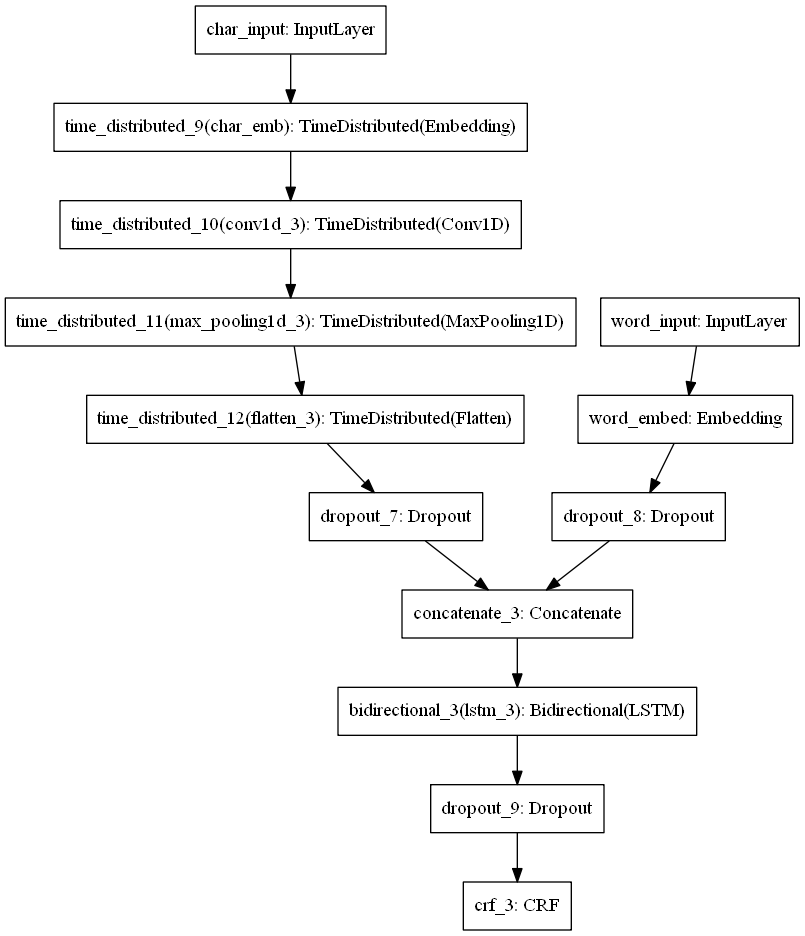

# NER_DNN

Named Entity Recognition.

Paper : https://arxiv.org/pdf/1603.01354.pdf  

Instructions for executing the program are provided in setup.txt.  

Model Architecture:  
This architecture has two input layers with word indices as input to one layer and character indices as input to the other
Uses CNN to train character level embeddings and pre-trianed word embeddings for words on the other side.
Concatenates both inputs and feeds to the Bi-directional LSTM with CRF layer on the output side.  

  

Observations:  
1) Model captures meaning of a word due in particular context due to word embeddings, but some words from training data that doesn't have the embeddings may not get labeled correctly. Adopted character level embeddings to represent such words. Char level embeddings will represent less frequent words and words learns in the context of local named entity as we are back propagating error to char embedding layer. These character level embeddings improves final F1 score.  
2) For sequence Labelling, used Bi-LSTM as it learns context from left and right temporal words which is critical for named entity recognition.    
3) Output CRF layer performs better compared to dense layer as some of the output labels are correlated to the previous labels.  

Hyper-Parameter Tuning:  
1) With Word-Embedding-Dimension = 100, char-embedding-dimension = 30, CNN-filters =  30, Filter-size =3, pool-size = 15, epochs=30__
   For Batch-size of [32,64,128]:  
   F1-score on validation set --->  [90.25, 89.40, 88.45]  
   
2) With epochs = 30 and Batch-size = 64 , Changing above Hyper-parameters each at a time.  
   For CNN-filters of [20,30]  
   F1-score on validation set --->  [89.75,89.40]
   
   For CNN Filter-size of [3,7]  
   F1-score on validation set --->  [89.40,89.22]  
   
   
F1-Score on test set:  
  With epochs = 30 and batch-size = 32  
  F1-score---> 85.04  
  Report----> (scaled to [0,1])                 
                
                precision  recall   f1-score  support 
                
        LOC       0.91      0.85      0.88      1653
        PER       0.94      0.89      0.92      1602
       MISC       0.77      0.76      0.77       702
        ORG       0.78      0.82      0.80      1660
      avg/total   0.86      0.84      0.85      5617
